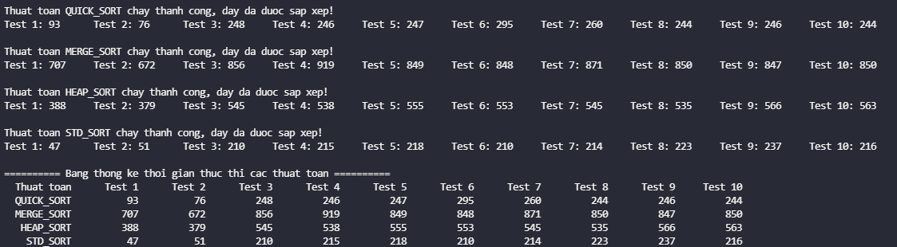
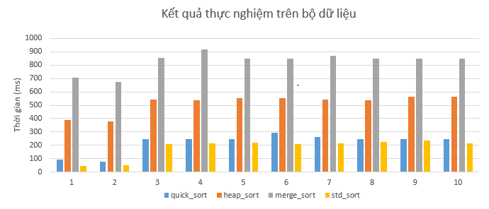

# Thực nghiệm các phương pháp sắp xếp tới hạn
## Mô tả thực nghiệm
1. Tạo bộ dữ liệu gồm 10 dãy, mỗi dãy khoảng 1 triệu số thực (ngẫu nhiên); dãy thứ nhất đã có thứ tự tăng dần, dãy thứ hai có thứ tự giảm dần, 8 dãy còn lại trật tự ngẫu nhiên
2. Viết các chương trình sắp xếp dãy theo các thuật toán QuickSort, HeapSort, MergeSort và chương trình gọi hàm sort của C++
3. Chạy thử nghiệm mỗi chương trình đã viết ở trên với bộ dữ liệu đã tạo, ghi nhận thời gian thực thi từng lần thử nghiệm
## Mô tả các thư mục trên GitHub
1. Thư mục `Gen_test` gồm:
* `gen.cpp`   : Chương trình sinh bộ dữ liệu
* `Output_Gen` : Gồm 10 file `*.txt` là bộ dữ liệu được sinh bởi `gen.cpp`
2. Thư mục `Sort_Test` gồm:
* `std_sort.h` : Mã nguồn thuật toán `std::sort`
* `heap_sort.h` : Mã nguồn thuật toán **Heap Sort**
* `quick_sort.h` : Mã nguồn thuật toán **Quick Sort**
* `merge_sort.h` : Mã nguồn thuật toán **Merge Sort**
* `main.cpp` : Chương trình thực nghiệm khảo sát thời gian thực thi các phương pháp sort trên bộ dữ liệu đã được tạo 
## Tiến hành thực nghiệm:
**Bước 1:** Chạy file `gen.cpp` để khởi tạo bộ dữ liệu thực nghiệm. Kết quả khi chương trình chạy thành công:

 
    

**Bước 2:** Chạy file `main.cpp` để tiến hành đo thời gian thực thi các thuật toán sort trên bộ dữ liệu vừa mới tạo. Kết quả khi chương trình chạy thành công:

 
    

## Kết quả thực nghiệm
* Bảng thống kê:

|             |   Test 1   |   Test 2   |   Test 3   |   Test 4   |   Test 5   |   Test 6   |   Test 7   |   Test 8   |   Test 9   |   Test 10   |
|-------------|------------|------------|------------|------------|------------|------------|------------|------------|------------|-------------|
|   STD_SORT  |    248     |    191     |    421     |    508     |    448     |    436     |    425     |    408     |    414     |     430     | 
|  MERGE_SORT |    844     |    813     |   1019     |   1163     |   1000     |   1000     |   1015     |   1000     |    999     |    1000     |  
|  HEAP_SORT  |    641     |    625     |    749     |    750     |    749     |    750     |    750     |    735     |    734     |     734     |
|  QUICK_SORT |     78     |     78     |    281     |    281     |    281     |    281     |    297     |    281     |    281     |    282      |

* Biểu đồ thống kê:

 
    

